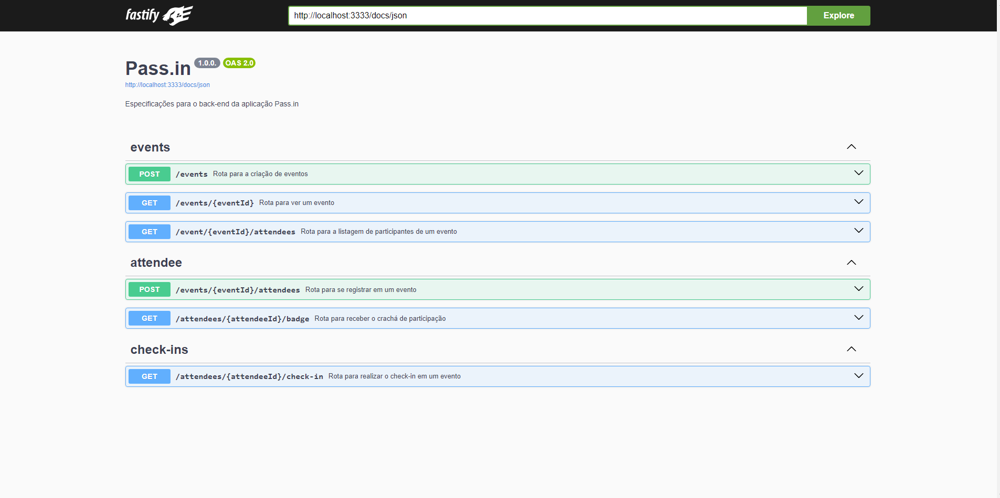

<h1 align="center"> Pass.in </h1>

<p align="center">
O pass.in é uma aplicação de gestão de participantes em eventos presenciais, onde a ferramenta permite que o organizador cadastre um evento e abra uma página pública de inscrição. Os participantes inscritos podem emitir uma credencial para check-in no dia do evento e o sistema fará um scan da credencial do participante para permitir a entrada no evento. Projeto criado durante a NLW Unite, da Rocketseat.<br/>
</p>

<p align="center">
  <a href="#-tecnologias">Tecnologias</a>&nbsp;&nbsp;&nbsp;|&nbsp;&nbsp;&nbsp;
  <a href="#-deploy">Rode Local</a>&nbsp;&nbsp;&nbsp;|&nbsp;&nbsp;&nbsp;
  <a href="#-english-version">English Version</a>&nbsp;&nbsp;&nbsp;&nbsp;&nbsp;&nbsp;
</p>

<p align="center">
  
</p>

## 🚀 Tecnologias

Esse projeto foi desenvolvido com as seguintes tecnologias:

- Typescript
- Node.js
- Fastify
- Zod
- Prisma
- SQLite
- Swagger
- TSX

### ✅ Requisitos

#### Requisitos Funcionais

- [x] O organizador deve poder cadastrar um novo evento;
- [x] O organizador deve poder visualizar dados de um evento;
- [x] O organizador deve poser visualizar a lista de participantes;
- [x] O participante deve poder se inscrever em um evento;
- [x] O participante deve poder visualizar seu crachá de inscrição;
- [x] O participante deve poder realizar check-in no evento;

#### Regras de Negócio

- [x] O participante só pode se inscrever em um evento uma única vez;
- [x] O participante só pode se inscrever em eventos com vagas disponíveis;
- [x] O participante só pode realizar check-in em um evento uma única vez;

### 🔠 Estrutura do Banco de Dados
```sql
-- CreateTable
CREATE TABLE "events" (
    "id" TEXT NOT NULL PRIMARY KEY,
    "title" TEXT NOT NULL,
    "details" TEXT,
    "slug" TEXT NOT NULL,
    "maximum_attendees" INTEGER
);

-- CreateTable
CREATE TABLE "attendees" (
    "id" INTEGER NOT NULL PRIMARY KEY AUTOINCREMENT,
    "name" TEXT NOT NULL,
    "email" TEXT NOT NULL,
    "event_id" TEXT NOT NULL,
    "created_at" DATETIME NOT NULL DEFAULT CURRENT_TIMESTAMP,
    CONSTRAINT "attendees_event_id_fkey" FOREIGN KEY ("event_id") REFERENCES "events" ("id") ON DELETE RESTRICT ON UPDATE CASCADE
);

-- CreateTable
CREATE TABLE "check_ins" (
    "id" INTEGER NOT NULL PRIMARY KEY AUTOINCREMENT,
    "created_at" DATETIME NOT NULL DEFAULT CURRENT_TIMESTAMP,
    "attendeeId" INTEGER NOT NULL,
    CONSTRAINT "check_ins_attendeeId_fkey" FOREIGN KEY ("attendeeId") REFERENCES "attendees" ("id") ON DELETE RESTRICT ON UPDATE CASCADE
);

-- CreateIndex
CREATE UNIQUE INDEX "events_slug_key" ON "events"("slug");

-- CreateIndex
CREATE UNIQUE INDEX "attendees_event_id_email_key" ON "attendees"("event_id", "email");

-- CreateIndex
CREATE UNIQUE INDEX "check_ins_attendeeId_key" ON "check_ins"("attendeeId");
```


## 💻 Rode Local

Para rodar o projeto localmente, basta cumprir as seguintes etapas:

1. Clonar o repositório
   ``` 
   git clone https://github.com/ssschneider/nlw-unite-node
   ```
2. Instalar as dependências
    ``` 
        npm i 
    ```
3. Rodar o servidor
   ``` 
    npm run dev
    ```
4. Rodar as migrations do banco de dados
   ``` 
   npm run db:migrate
   ```
5. Acessar o Banco de Dados
   ``` 
   npm run db:studio
   ```
6. Acessar a documentação Swagger para melhor compreensão das rotas
   - http://localhost:3333/docs

## 🌎 English Version

📌 Pass.in is a Management Application for in-person events, where the tool allows the organizer to register an event and open a public registration page. Registered participants can issue a credential for check-in on the day of the event and the system will scan the participant's credential to allow entry to the event. The project created during NLW Unite, by Rocketseat.

💻 Technologies used:
- Typescript, Node.js, Fastify, Zod, Prisma, SQLite, Swagger and TSX

> You can check out the deploy by run locally following these steps:
  1. Clone the repository
     ``` 
     git clone https://github.com/ssschneider/nlw-unite-node
     ```
  2. Install the dependencies
      ``` 
          npm i 
      ```
  3. Run the server
     ``` 
      npm run dev
      ```
  4. Run the database migrations
     ``` 
     npm run db:migrate
     ```
  5. Access the database
     ``` 
     npm run db:studio
     ```
  6. Access the Swagger documentation
     - http://localhost:3333/docs

<br/><br/>

---
### Desenvolvido por Sarah Schneider 🖖